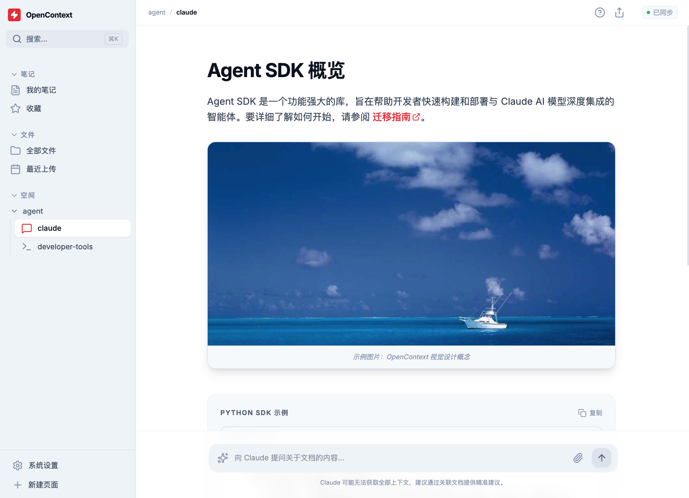

# Open-Context

一款开源的笔记、文件、工作空间管理工具，旨在帮助 AI Agent 更好地理解和利用上下文信息。通过集成多模态笔记、文件管理和工作空间管理功能，为 AI 提供丰富的上下文支持。

## ✨ 特性

- 🗂️ **多工作空间支持** - 隔离不同项目的数据和资源
- 📝 **6 种笔记类型** - 富文本、Markdown、代码、表格、思维导图、流程图
- 📁 **文件管理** - 导入文件、预览和云端同步
- 🔍 **向量检索** - 基于 Qdrant 的语义搜索
- 🌲 **依赖关系图** - 代码符号和依赖关系可视化
- 🔄 **事件系统** - 完整的前后端通信机制
- 🌐 **MCP 协议支持** - 对外提供标准化服务接口

## 📸 预览



## 🏗️ 项目架构

Open-Context 是一个基于 Tauri 的混合桌面应用，采用 Rust + TypeScript + Node.js 三层架构：

- **Tauri 桌面外壳**（Rust）：应用窗口管理、系统集成、IPC 通信
- **Node.js 后端服务**：RAG 引擎、向量检索、代码索引、任务队列
- **React 前端界面**：用户交互、多模态笔记编辑、可视化展示

### 核心技术栈

| 层级     | 技术                         | 说明                |
| -------- | ---------------------------- | ------------------- |
| 桌面外壳 | Tauri 2.x + Rust             | 跨平台桌面框架      |
| 后端服务 | Node.js + Hono + TypeScript  | Web 框架 + RAG 引擎 |
| 前端界面 | React 19 + Vite + TypeScript | 现代前端技术栈      |
| 状态管理 | Zustand + React Query        | 客户端/服务端状态   |
| UI 组件  | Radix UI + Tailwind CSS 4    | 无障碍组件库        |
| 富文本   | Tiptap + ProseMirror         | 可扩展编辑器        |
| 数据库   | SQLite + LevelDB             | 嵌入式数据库        |
| 向量搜索 | Qdrant                       | 向量数据库          |
| 代码解析 | Tree-sitter                  | 语法解析器          |

## 📂 项目结构

```
open-context/
├── src/                     # Rust 源码（Tauri 后端）
│   ├── app_state*.rs        # 状态管理和数据模型
│   ├── app_events.rs        # 事件系统定义
│   ├── app_config.rs        # 配置管理
│   └── app_commands.rs      # Tauri IPC 命令
│
├── packages/
│   ├── open-web/            # React 前端
│   │   └── src/
│   │       ├── components/  # UI 组件（Tiptap 编辑器、侧边栏）
│   │       ├── hooks/       # React Hooks（事件监听等）
│   │       └── routes/      # TanStack Router 路由
│   │
│   └── open-node/           # Node.js 后端（RAG 引擎）
│       └── src/
│           ├── services/    # 业务服务（索引、查询、图）
│           ├── indexers/    # 代码索引器
│           └── db/          # 数据库层（LevelDB、Qdrant）
│
├── docs/                    # 技术文档
├── examples/                # 代码示例
└── tests/                   # 测试文件
```

详细目录结构和命名规范请参考 [CLAUDE.md](./CLAUDE.md#目录结构规范)。

## 📦 子项目文档

本项目采用 Monorepo 架构，包含以下子项目：

| 子项目        | 说明                         | 文档                                                           |
| ------------- | ---------------------------- | -------------------------------------------------------------- |
| **open-node** | Node.js 后端服务（RAG 引擎） | [packages/open-node/README.md](./packages/open-node/README.md) |
| **open-web**  | React 前端应用               | [packages/open-web/README.md](./packages/open-web/README.md)   |

每个子项目都有独立的 README 文档，包含各自的安装、配置和开发说明。

## 🎯 核心功能

### 1. 多模态笔记

支持 6 种笔记类型，每种都有专门的编辑器：

| 类型     | 技术                        | 特性                         |
| -------- | --------------------------- | ---------------------------- |
| 富文本   | Tiptap/ProseMirror          | 格式化、媒体、表格、协同编辑 |
| Markdown | unified + remark + rehype   | GFM、数学公式、Mermaid 图表  |
| 代码     | Monaco Editor               | 多语言高亮、LSP、代码执行    |
| 表格     | Handsontable + HyperFormula | Excel 风格公式、导入导出     |
| 思维导图 | Konva.js + Dagre            | 自动布局、主题模板、导出     |
| 流程图   | Mermaid.js                  | 可视化设计、子流程、导出     |

### 2. 工作空间管理

- **多工作空间**：隔离不同项目的数据和资源
- **资源导入**：Git 仓库、网页、本地文件夹、笔记
- **向量索引**：基于 Qdrant 构建语义检索索引
- **RAG 查询**：结合向量搜索和依赖关系图的智能检索

### 3. 文件管理

- **文件导入**：支持各种文件格式的预览和分类
- **云端同步**：支持同步到 COS 云端存储
- **向量检索**：语义检索、文件名检索、内容检索

### 4. 事件系统

完整的类型安全事件系统，支持前后端通信。详细文档：[docs/EVENT_SYSTEM.md](./docs/EVENT_SYSTEM.md)

- 6 大类事件（应用生命周期、窗口管理、应用状态、服务管理、系统事件、自定义）
- 多窗口支持、类型安全、10+ 个便捷 React Hooks

### 5. 状态管理

基于 SQLite 的应用状态持久化管理。详细文档：[docs/APP_STATE_USAGE.md](./docs/APP_STATE_USAGE.md)

- 6 种核心数据模型、30+ 个 CRUD 操作
- 线程安全、自动索引、级联删除

## 💾 数据存储

所有数据存储在配置目录 `~/.config/open-context/` 下（可通过 `OPEN_CONTEXT_CONFIG_DIR` 环境变量自定义）：

```
~/.config/open-context/
├── config.json          # 全局配置
├── app_state.db         # SQLite 数据库（工作空间、笔记、文件）
├── store.bin            # Tauri Store（前端状态）
├── leveldb/             # LevelDB（符号、依赖关系图）
├── qdrant/              # Qdrant 向量数据库
├── logs/                # 应用日志
└── workspaces/          # 工作空间数据
```

## 🚀 快速开始

### 环境要求

- Rust 1.90.0+
- Node.js 18.0.0+
- pnpm 9.0.0+

### 安装与运行

```bash
# 安装依赖
pnpm install

# 开发模式（启动所有组件）
pnpm dev

# 单独启动组件
pnpm dev:web       # 前端 (http://localhost:1420)
pnpm dev:server    # Node.js 服务器 (http://localhost:4500)
pnpm dev:app       # Tauri 桌面应用

# 构建
pnpm build:all     # 构建所有组件
```

### 常用命令

```bash
# 测试
cargo test --lib                  # Rust 测试
pnpm --filter open-node test      # Node.js 测试
pnpm --filter open-web test       # 前端测试

# 代码检查与格式化
pnpm lint                          # 检查所有代码
pnpm fmt                           # 格式化所有代码
```

## 📡 API 端点

Node.js 服务器运行在 `http://localhost:4500`，主要接口：

- `/workspaces/*` - 工作空间 CRUD
- `/repos/*` - 仓库管理
- `/repos/:repoId/index` - 触发索引任务
- `/query/vector` - 语义搜索
- `/query/code` - 代码搜索（向量 + 图）
- `/graph/*` - 依赖关系图查询

详细 API 文档请参考 [docs/TAURI_COMMANDS.md](./docs/TAURI_COMMANDS.md)。

## 📚 技术文档

### 核心系统

- [事件系统](./docs/EVENT_SYSTEM.md) - 前后端通信机制
- [状态管理](./docs/APP_STATE_USAGE.md) - 数据持久化管理
- [配置管理](./docs/APP_CONFIG_USAGE.md) - 应用配置系统
- [Tauri 命令](./docs/TAURI_COMMANDS.md) - IPC 命令参考

### 子项目文档

- [Node.js 后端](./packages/open-node/README.md) - RAG 引擎、代码索引、向量检索
- [React 前端](./packages/open-web/README.md) - UI 组件、路由、状态管理

### 代码示例

- [事件系统示例](./examples/event_usage.rs)
- [配置管理示例](./examples/config_usage.rs)

### 开发指南

- [CLAUDE.md](./CLAUDE.md) - 完整的项目开发指南和架构文档

## ⚠️ 当前状态

### 已完成 ✅

- ✅ Tauri 桌面外壳框架
- ✅ 事件系统（27+ 种事件，10+ React Hooks）
- ✅ 状态管理（6 种数据模型，30+ CRUD 操作）
- ✅ 配置管理（线程安全、热重载）
- ✅ Node.js RAG 引擎（TypeScript/JavaScript 索引）
- ✅ 前端 UI 框架（路由、状态、国际化、编辑器）

### 进行中 ⏳

- ⏳ Tauri 与 Node.js IPC 集成
- ⏳ 进程管理器（app_sidecar.rs）
- ⏳ 笔记功能前端实现
- ⏳ 多语言代码索引支持

## 🤝 贡献

欢迎贡献代码、报告问题或提出建议！

1. Fork 本仓库
2. 创建特性分支 (`git checkout -b feature/AmazingFeature`)
3. 提交更改 (`git commit -m 'Add some AmazingFeature'`)
4. 推送到分支 (`git push origin feature/AmazingFeature`)
5. 开启 Pull Request

## 📄 许可证

MIT License - 详见 [LICENSE](LICENSE) 文件

## 📧 联系方式

- **GitHub Issues**: [提交问题](https://github.com/your-repo/open-context/issues)
- **邮箱**: michaelbguo@tencent.com
